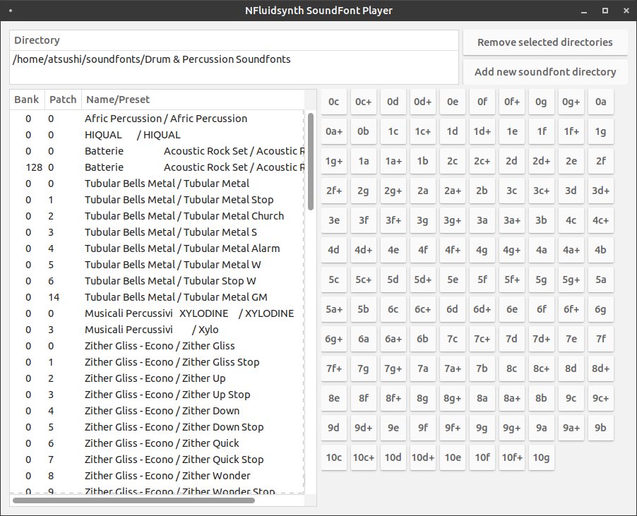

# soundfont-player-cs

It is an experimental SoundFont player based on [nfluidsynth](https://github.com/atsushieno/nfluidsynth), [NAudio](https://github.com/naudio/NAudio), and [xwt](https://github.com/mono/xwt).

It is intended to easily find instruments, namely drum kits, across multiple soundfont files.

Since Xwt lacks a lot of features and no one is serious about Gtk3 desktop, I might quickly give up and switch to new codebase in different frameworks or even different languages.

